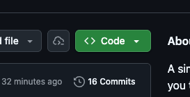
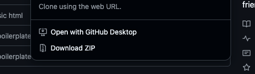
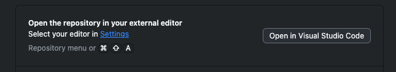
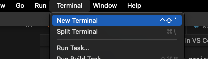
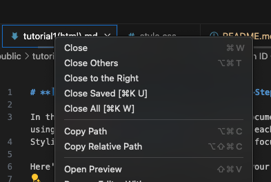
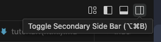

Follow these steps to clone the project from GitHub, open it in VS Code, run it locally, and work with the tutorial alongside your HTML file.


## 1. Clone the Project from GitHub

1. Go to the project page on **GitHub.com**.
2. Click the green **Code** button.




3. Select **Open with GitHub Desktop**.



4. GitHub Desktop will open , choose where you want to save the project, then click **Clone**.


## 2. Open the Project in VS Code

1. In **GitHub Desktop**, click **Open in Visual Studio Code** (upper-right corner).


2. VS Code will launch with the project folder loaded.


## 3. Open the Terminal & Run the App

1. In VS Code, open a terminal: ( very top menu bar )

   * **Terminal → New Terminal**


2. Run the project with:


   ```bash
   npm install
   node app.js
   ```

3. This will start a server and give you a link that looks like:

   ```
   http://localhost:3000
   ```

4. **Command-click** (Mac) or **Ctrl-click** (Windows) the link in the terminal to open it in your browser.


## 4. Set Up Your Workspace (Two Screens)

To follow the tutorial while editing your code:

1. In VS Code, open **tutorial1(html).md** by clicking on it.
2. Right-click the tab and choose **Open Preview**.
<br>

</br>
   * This gives you the rendered Markdown view.
3. Open **index.html** in another tab( new tab button in top right corner)



4. Drag one tab to the side so you have **tutorial1(html).md (Preview)** on one side and **index.html** on the other.

This lets you read instructions and code at the same time.

---

## 5. Follow the Tutorial & Build Files

* Start with a **fresh index.html** file.
* Follow the steps in `tutorial1(html).md`.
* As you go, add content to **index.html** and create any additional files the tutorial requires.
* Your changes will appear when you refresh your browser window that is showing the **localhost** link.

---

## 6. View Your Changes

Whenever you update your HTML, CSS, or other files:

* Save your changes
* Refresh the browser window that opened from **node app.js**
* You’ll see the update immediately
