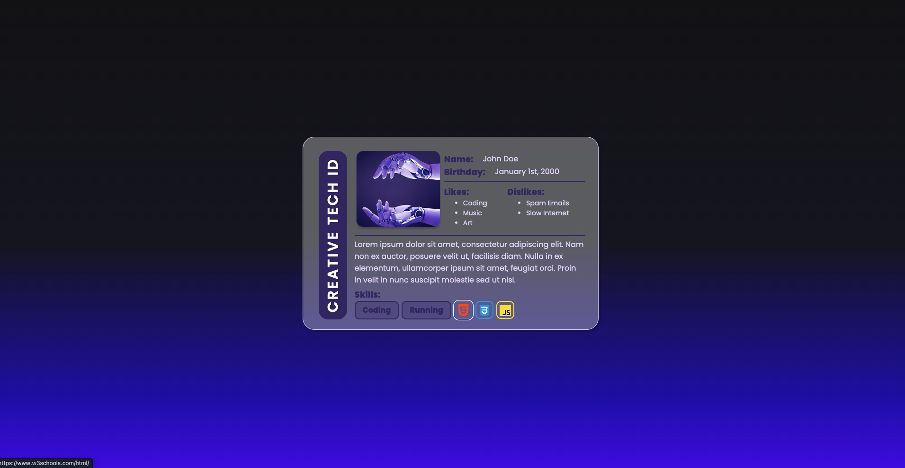

# **📘 Building an ID Card in HTML — Step-by-Step Tutorial**

In this tutorial, you’ll build a full HTML document that displays a simple **Creative Tech ID Card**. We’ll start from scratch using the **HTML:5 boilerplate**, learn what each tag does, and assemble the content section by section.
Styling (CSS) will come later for now, we’re focusing on clean, structured HTML.

Here's a visual of what you will be making, your's ofcourse will be more personalized: 



---

## **1. Start With the HTML:5 Boilerplate**

In the public folder create a new file: ( do this by right-clicking public and selecting new file)

1. Create a new file → `index.html`
2. Type `!` and press **Enter** (this is Emmet’s shortcut for HTML:5)
3. You should now see something like this:

```html
<!DOCTYPE html>
<html lang="en">
<head>
    <meta charset="UTF-8">
    <meta name="viewport" content="width=device-width, initial-scale=1.0">
    <title>Document</title>
</head>
<body>
    
</body>
</html>
```
4. Change "Document" to your Name:

```html

    <title>John Doe</title>

```


### **What each part means**

| Tag                         | Purpose                                                         |
| --------------------------- | --------------------------------------------------------------- |
| `<!DOCTYPE html>`           | Tells the browser this is an HTML5 document                     |
| `<html lang="en">`          | Wraps all HTML content and specifies the language <a href="https://www.w3schools.com/tags/ref_language_codes.asp">(view full list)</a>,|
| `<head>`                    | Holds information *about* the page, not shown on the screen     |
| `<meta charset="UTF-8">`    | Ensures all characters (letters, emojis, symbols) work properly |
| `<meta name="viewport"...>` | Makes the layout scale properly on phones/tablets               |
| `<title>`                   | Sets the title shown on the browser tab                         |
| `<body>`                    | Everything inside here is visible on the webpage                |

---

## **2. Create the Main Card Structure**

Inside the `<body>`, add a `<main>` element to hold the entire ID card:

```html
<body>
    <main>
        
    </main>
</body>
```

`<main>` is used for the primary content of the page.

---

## **3. Add the Title Bar**

Inside `<main>`, we'll add a simple bar at the top with the page title:

```html
<main>
    <div>
        <h1>Creative Tech ID</h1>
    </div>
</main>
```


| Tag      | Purpose                                                |
| -------- | ------------------------------------------------------ |
| `div`     | is a simple container, like divider|
| `<h1>` | is the highest-level heading on the page|


---

## **4. Add the Main Content Area**

Next, we’ll build the main layout of the ID card:

```html
<main>
    <div>
        <h1>Creative Tech ID</h1>
    </div>

    <div>
        
    </div>
</main>
```

This second `<div>` will hold all the profile content.

---

## **5. Create the Top Section (Image + Personal Info)**

Inside the content container, add a “top” section:

```html
<div>
    

    <div>
        <div>
            <h2>Name:</h2>
            <div>John Doe</div>
        </div>

        <div>
            <h2>Birthday:</h2>
            <div>January 1st, 2000</div>
        </div>

        <div>
            <h2>Likes:</h2>
            <ul>
                <li>Coding</li>
                <li>Music</li>
                <li>Art</li>
            </ul>
        </div>

        <div>
            <h2>Dislikes:</h2>
            <ul>
                <li>Spam Emails</li>
                <li>Slow Internet</li>
            </ul>
        </div>
    </div>
</div>
```

### **New elements explained**

| Tag      | Purpose                                                |
| -------- | ------------------------------------------------------ |
| `<h2>` | is the second-level heading on the page|
| ``  | Displays images                                        |
| `alt=""` | Text shown to screen readers or if image fails to load |
| `<ul>`   | Unordered list (bullet points)                         |
| `<li>`   | Individual list item                                   |

---

## **6. Add the Bottom Section (Bio + Skills)**

After the top section, add another `<div>` for the lower part of the ID card:

```html
<div>
    <p>
        Lorem ipsum dolor sit amet, consectetur adipiscing elit. Nam non ex auctor,
        posuere velit ut, facilisis diam. Nulla in ex elementum, ullamcorper ipsum
        sit amet, feugiat orci.
    </p>

    <div>
        <h2>Skills:</h2>

        <div>
            <div>Coding</div>
            <div>Running</div>

            <a href="https://www.w3schools.com/html/" target="_blank">
                
            </a>

            <a href="https://www.w3schools.com/css/" target="_blank">
                
            </a>

            <a href="https://www.w3schools.com/js/" target="_blank">
                
            </a>
        </div>
    </div>
</div>
```

### **New elements explained**

| Tag               | Purpose                         |
| ----------------- | ------------------------------- |
| `<p>`             | Paragraph text                  |
| `<a>`             | Link to another page or website |
| `target="_blank"` | Opens the link in a new tab     |

---

## **7. Final Full HTML File (No CSS Yet)**

Here is the full clean version you will build:

```html
<!DOCTYPE html>
<html lang="en">
<head>
    <meta charset="UTF-8">
    <meta name="viewport" content="width=device-width, initial-scale=1.0">
    <title>Creative Tech ID Card</title>
</head>
<body>
    <main>
        <div>
            <h1>Creative Tech ID</h1>
        </div>

        <div>
            <div>
                

                <div>
                    <div>
                        <h2>Name:</h2>
                        <div>John Doe</div>
                    </div>

                    <div>
                        <h2>Birthday:</h2>
                        <div>January 1st, 2000</div>
                    </div>

                    <div>
                        <h2>Likes:</h2>
                        <ul>
                            <li>Coding</li>
                            <li>Music</li>
                            <li>Art</li>
                        </ul>
                    </div>

                    <div>
                        <h2>Dislikes:</h2>
                        <ul>
                            <li>Spam Emails</li>
                            <li>Slow Internet</li>
                        </ul>
                    </div>
                </div>
            </div>

            <div>
                <p>
                    Lorem ipsum dolor sit amet, consectetur adipiscing elit. Nam non ex auctor,
                    posuere velit ut, facilisis diam. Nulla in ex elementum, ullamcorper ipsum
                    sit amet, feugiat orci.
                </p>

                <div>
                    <h2>Skills:</h2>

                    <div>
                        <div>Coding</div>
                        <div>Running</div>

                        <a href="https://www.w3schools.com/html/" target="_blank">
                            
                        </a>

                        <a href="https://www.w3schools.com/css/" target="_blank">
                            
                        </a>

                        <a href="https://www.w3schools.com/js/" target="_blank">
                            
                        </a>
                    </div>
                </div>
            </div>
        </div>
    </main>
</body>
</html>
```

---
